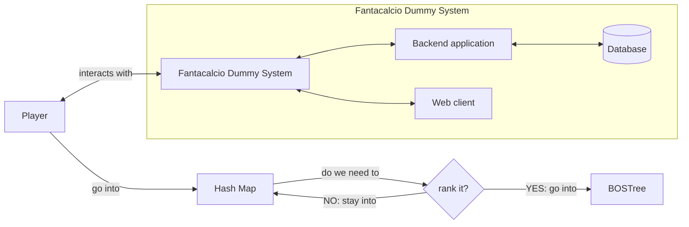

# Leaderboard system

As a part of my [Fantacalcio Dummy System](https://github.com/AlessVolpe/FantacalcioDummySystem.git)
project, I wanted to experiment with type-safe and efficient data structures
to implement a ranking algorithm.

The ranking happens in two different moments, when a player is added to the
system is at first put into a hashmap, then when the system needs to compile
the leaderboard every player is moved to a self-balancing AVL tree.

## Player pool or hashmap

The player pool is implemented using a hashmap, a data structure that maps
key to value. An index is computed via a hash function h, generically it maps
the universe U of keys

```
h: U -> {0, ..., m-1}
```

to array indices or slots within
the table for each

```
h(x) ∈ 0, ..., m-1 where x ∈ S and m<n
```

A well implemented hash map offers constant (linear at worst) time complexity
for insertion, lookup and deletion; while space complexity is linear. More
specifically, during lookup the key is hashed and the resulting hash indicates
where the corresponding value is stored: works wonders for our case of study!

I find really important to say thank you for the
[original implementation](https://github.com/DavidLeeds/hashmap.git) to
[DavidLeeds](https://github.com/DavidLeeds), from his repo I couldn't take his
amazing work on the CMake files because it didn't fit my use case.

## Leaderboard or BOSTree

The leaderboard is implemented using an order statistic tree,
a variant of the binary search tree, implemented as self-balancing AVL tree
with two additional methods:

- Select(i), which finds i'th smallest element;
- Rank(x), which returns the rank of a given element.

Both of those two methods run in a logarithmic time complexity, which is indeed
the worst case scenario considering it happens when implemented as a
self-balancing tree; it's definitely pretty good though!

To turn a regular search tree into an order statistic tree, the nodes need to
store one additional value for the size of the subtree rooted at that node.
All operation that modify the tree must adjust this information to preserve the
invariant that

```
size[x] = size[left[x]] + size[right[x]] + 1
```

where ```size[NULL] = 0```, by definition.
The tree is implemented using map semantics, that is, there are separate key
and value pointers.

Again it's really important to me to thank also
[phillipberndt](https://github.com/phillipberndt) for the
[original implementation](https://github.com/phillipberndt/bostree.git) and
testing both on AFL and Valgrind.

## A really simple drawing

